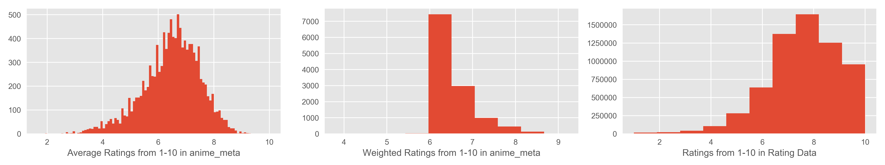
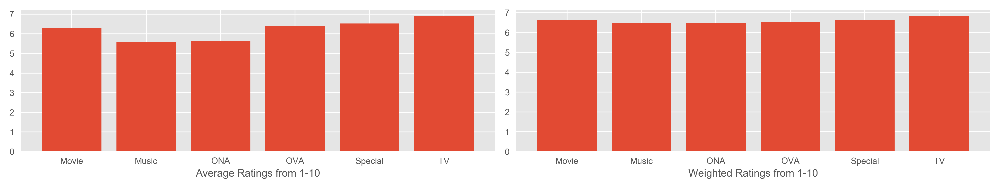
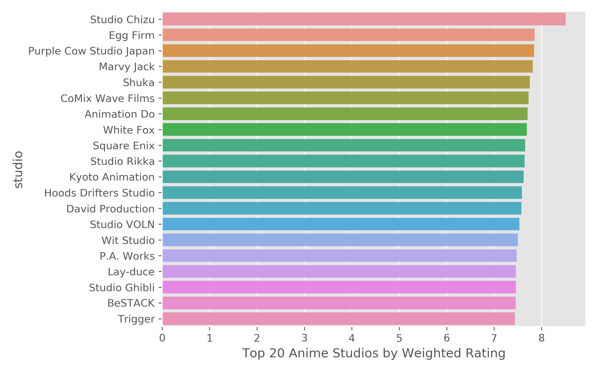
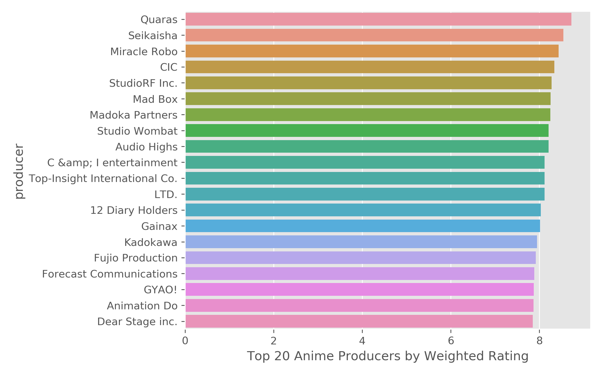
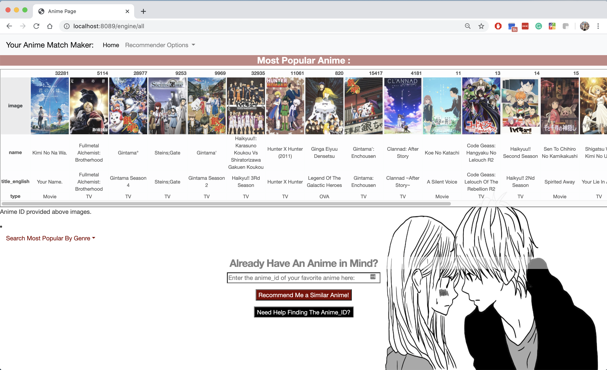
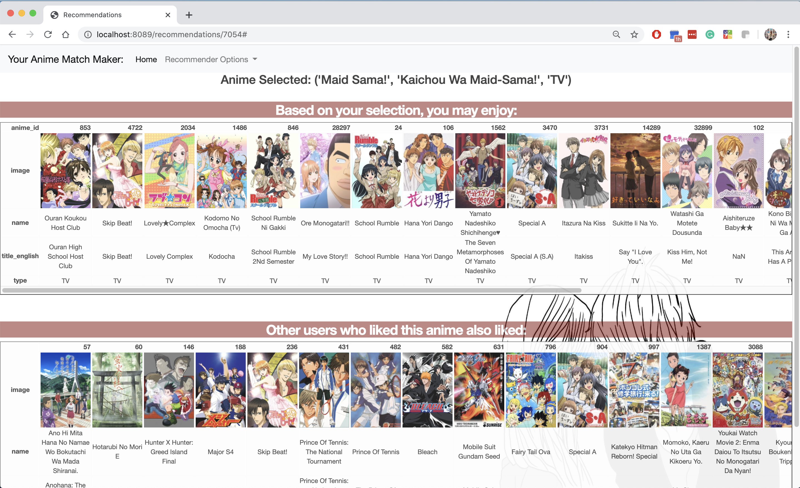
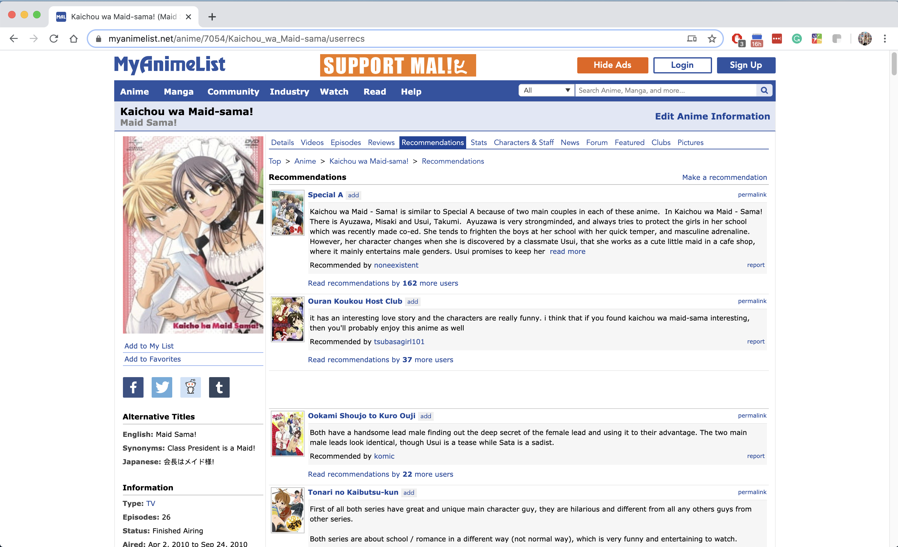
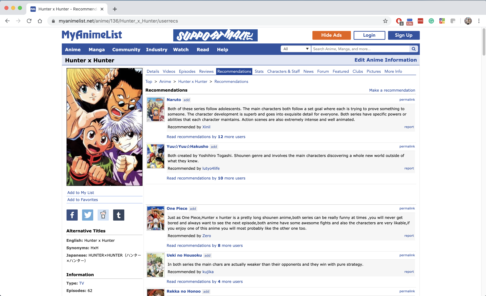
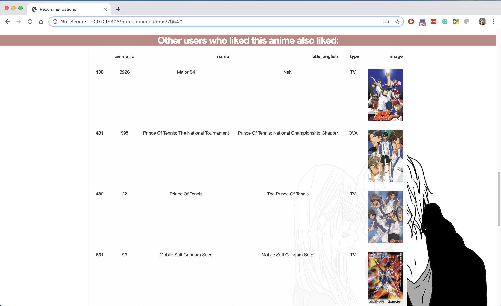
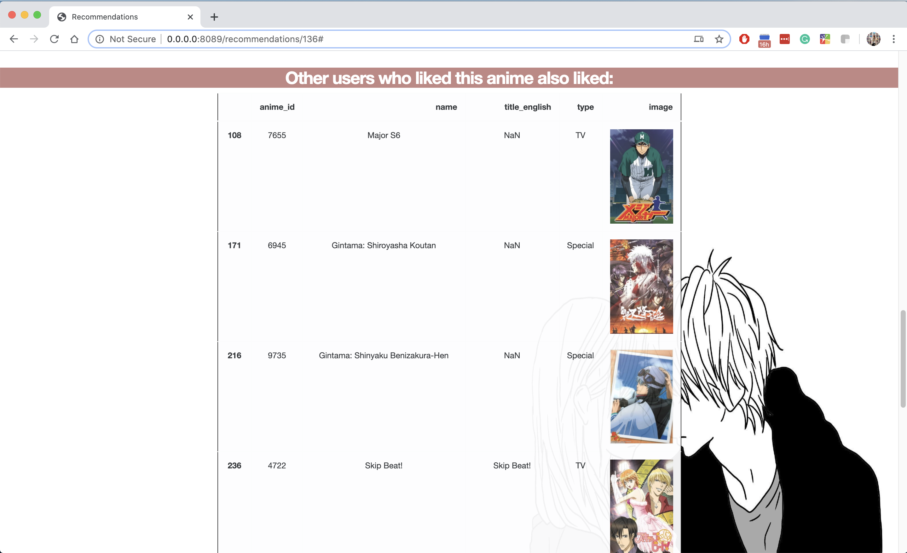

# Find Your Next Anime

## Motivations & Goals
Since shelter-in-place was enacted, more people have been staying home looking for more ways to pass the time. Like many, I found myself wanting to escape to a world of fantasy, and found that anime was the best way to do this.
 However, when I finished one anime, I was surpised how difficult it was to find a similar anime to the one I enjoyed. It required searching on Google and going through various forums to find suggestions that seemed aligned to my tastes.
 **I have two goals for this project:**
 1) A content based recommender that will recommend shows/movies similar to my last favorite anime
 2) An item-item collaborative filter recommender system that will recommend anime based on the ratings of other users who also liked that anime.
 **To evaluate my efforts:**
 1) Spot check a few instances of the recommender with some hand-selected anime from each genre that I am familiar with. Compare the results against MyAnimeList.net recommendations.
 2) Predict ratings for subset of users (for which ratings data is present), compare the predicted ratings to actual ratings, evaluate using RMSE.
 **Methodology**
 I will be using datasets from Kaggle that have been pre-scraped for the purposes of an anime recommender system.
 Using the anime meta data, I will first create a content based recommender using similarity scores calculated for each anime. I will test both cosine similarity, and correlation similarity metrics, and evaluate my efforts with the RMSE on predicted ratings.
 Then, using the ratings dataset, I will build a collaborative filter based recommender system with Spark's ALS model. My model will also be evaluated using the RMSE.
 I will display both the content based and collaborative filter recommendations for a hybrid approach on a flask application.

## The Data:
 All data is from Kaggle datasets, scraped from MyAnimeList.net.
 Last updated 2017 & 2018
 **-anime_df**: 12,294 animes with name, genre, type, number of episodes, avg_rating, and members
 **-rating_df**: 7M reviews of 11,200 animes from 73,515 users
 **-anime_meta**: 14,478 animes with additional features: English title, dates aired, duration of anime, rating (PG,G,R, etc.), producer, studio, opening & ending theme songs
 **-users_meta**: 302,673 unique users with number of episodes watched, along with gender, birthdate, location, membership_date
 **-Optional: concepts_titlesonly**: 391706 anime titles & concepts, but no anime_id, so will be difficult to group with current dataset

## Data Cleaning
-Ratings: Removed all ratings with '-1' which indicates no rating.
 -NOTE: Ratings matrix does not have ALL of the ratings provided by the users that make up the average rating column in the anime_df, will need to consider this for the collaborative filter based recommender. 
 
 **Combining dataframes to get one large dataframe with all metadata for each anime**
 -The function for below cleaning is stored in src/data_funcs.py, full_anime_df() function: 
 The anime data and rating data were combined in order to calculated weighted rating based on number of members that rated the anime.
 -The anime meta data was joined with the anime dataset through the anime_id in order to display all available meta data for each anime.
 -The rating types were streamlined to: G, PG, PG-13, R, R+,Rx, and "Unknown" for any blank values.
 -The blanks for genre, studio, and producer were also filled with "Unknown".
 -Dropped any duplicate columns contained in both the anime_meta dataset, and the anime dataset. Dropped any irrelevant columns with many nulls, or data that is not useful.
  **Exploding the Genre, Producer, & Studio columns to see trends**
 -The function for performing this operation is the explode_text() function in src/data.py.

## EDA
**Comparing the average rating to the weighted ratings**
 -avg_rating from the anime dataset: 6.473902
 -weighted_rating average from the anime dataset: 6.654531
 -Average ratings from the user rating dataset: 7.8

 -Weighted ratings are more closely centered around the mean, with more right skew, meanwhile average ratings are more normally distributed.
 -The ratings dataset more closely resembles the average ratings, but centered around a higher mean rating. Could be due to rating data missing some ratings of animes listed in the anime dataset.

**Ratings across different features** : No major differences between anime type or source

 -On average (not weighted), the PG-13 & R animes are doing slightly better than other rating types.

-Comparing different genres, there are some genres that do much better/worse than majority.

-Comparing the top 20 studios and producers, there are clear studios that are more highly rated by users.
   

## Baseline Model:
**Use the average rating of the training data to predict user ratings of the test dat**
 -RMSE: 1.57
 -Using just the average to predict user ratings already gathers pretty decent results. 
## Content Based Recommender System:
**Anime_id Keyword**
 -To help users search for the anime_id desired, a helper function called find_id() in src/model_funcs.py was created, which will return all titles that have the keyword.
 -The exploration of this process is stored in Content_Based.ipynb notebook, while the actually recommendation functions are store in model_funcs.py.
 **Baseline Content Based Recommender:**
 -Features: Type (Movie, TV, etc.), Source (Manga, Music, Book, etc.), and Rating Type (PG, R, etc.).
 -Similarity Metrics: Tested Cosine Similarity & Correlation.
 RMSE on 50K random samples from test set: 1.362
 RMSE(Cosine):, RMSE(Correlation):
 **Content Based Recommender Iteration 2:**
 -Added dummified genre to the content based model
 -Overall, the genre significantly helped with the recommendations. The recommender is now recommending more highly rated anime that is closer to the genre specified, though still not perfect
 RMSE on 50K random samples from test set: 1.362, no change from prior, though the recommendations for certain spot checks are vastly different.
 **Content Based Recommender Iteration 3**
  -Based on the EDA, some producers/studios have higher ratings overall than others, so I created dummy variables for each of the top 20 studios/producers, but this had no impact on the recommendations.
 -Explored clusters of producers & studios, but as there are many duplicates in multiple clusters, did not think this would be worth exploring.
<pre>Clusters of Producers:
 0, Bandai Visual, Pink Pineapple, Lantis, Sanrio, Fuji TV
 1, Unknown, Bandai Visual, Aniplex, NHK, TV Tokyo
 2, TV Tokyo, Tokyo Movie Shinsha, Sanrio, Sotsu, Milky Animation Label
 3, NHK, Sanrio, Tokyo Movie Shinsha, Fuji TV, Milky Animation Label
 4, Aniplex, Tokyo Movie Shinsha, Sanrio, Fuji TV, Milky Animation Label</pre>
<pre>Clusters of Studios:
 0, Sunrise, Madhouse, Production I.G, Studio Pierrot, TMS Entertainment
 1, Unknown, Sunrise, Madhouse, J.C.Staff, Studio Pierrot
 2, Studio Deen, Toei Animation, Sunrise, OLM, Xebec
 3, J.C.Staff, Toei Animation, Sunrise, OLM, Xebec
 4, Toei Animation, Unknown, Nippon Animation, OLM, Tatsunoko Production</pre>

## Simple Collaborative Filter Recommenders with KNN & SVD
**Rating Data Statistics:**
 On average, each user provides 90 ratings, median number of ratings given per user is 45
 On average, each anime has 638 ratings, median number of ratings provided per anime is 57

 For our simple collaborative filter recommenders, we want to recommend the most popular movies from our most active users. I will be removing all users with less than 300 ratings, and all animes with less than 2500 ratings. 
 This leaves us with 4326 users, and 694 anime. This leaves us with 1M reviews.
 The model functions for below KNN/SVD are stored in src/Popular_CollabFilt.py.
### KNN Collaborative Filter
Explored simple KNN & SVD based collaborative filter models, imputing the NaN's with zeros, average per user, and average per rating. The exploration of this process can be viewed in Simple_CF.ipynb.
  **Example from KNN: Fill in NaN's with average anime rating:**
<pre>Recommendations for 120 ['Fruits Basket']:
 1: ['Ouran Koukou Host Club'], with distance of 0.373
 2: ['Vampire Knight'], with distance of 0.462
 3: ['07-Ghost'], with distance of 0.480
 4: ['Lovely★Complex'], with distance of 0.484
 5: ['Special A'], with distance of 0.485
 6: ['Vampire Knight Guilty'], with distance of 0.490
 7: ['Kamisama Hajimemashita'], with distance of 0.496
 8: ['Cardcaptor Sakura'], with distance of 0.498
 9: ['Howl No Ugoku Shiro'], with distance of 0.498
 10: ['D.N.Angel'], with distance of 0.499</pre>
### Simple SVD (imputing the NaNs with average rating per anime) Latent Features:
Feature 0: Action fantasy anime with war themes, Military Genre
 Feature 1: Action and Sci-fi, supernatural
 Feature 2: Not clear, some comedies, romance, action, video game military
 Feature 3: Not clear - Action horror sci-fi, A-1 studio
 Feature 4: Military, Action adventure, Sunrise and Bones studio
 Feature 5: Naruto, Bleach and Dragonball like movies
 Feature 6: High school with some random action
 Feature 7: Slice of life or romance, comedy, school
 Feature 8: Unclear - mix of everything.
 Feature 9: Supernatural and psychological</pre>
 **Result:** Upon spot-checking a recommendation, the results did not perform as well as KNN. SVD is having trouble recommending the correct genre and is recommending action animes for every attempt. This is similar to what we saw during latent feature exploration with the action genre in nearly every latent feature.
   **Ultimately did not proceed with these simple options due to high computational costs, these models were created only with the most popular anime, and the most active users.**
 A drawback of using these simple Collaborative Filter System is only using the most popular anime to make recommendations. Next we will look into ALS matrix factorization with Spark in order to use all of the data present.

## Model Based Collaborative Filtering with Spark ALS
-Lastly, I used Spark's ALS model to fit a collaborative filter based recommender that will recommend anime based on the preferences of other users who liked the anime you provided.
 -Basline hyper-parameters: cold-start strategy: drop, 10 latent features, 20 max iterations and 0.1 regularization, this gave me a validation RMSE of 0.13. I then used ALS model's cross validator estimator to tune the model.
 -Functions for this recommender are stored in src/als_collab_filt.py, and tuning of the model is stored in ALS_tuning.ipynb. Tuning of the model was done on AWS Sagemaker.
  **Results**
 Train RMSE: 1.03
 Validation RMSE: 1.15
 Test RMSE on Cross-Validated (and tuned) model: 1.13
 Final Model had 15 latent features.
 **Explore latent features:**
 Latent features seem to be attempting to separate based on level of maturity and genre, with certain themes (school, sports, etc).
 0: RX/mature
 1: Unclear, mix of random genres, mature
 2: Action/Adventure
 3: Dementia, fantasy, sci-fi, magic
 4: Unclear, random mix of everything
 5: Rated G, comedy, kids
 6: Romance, Yaoi
 7: Supernatural, PG-13 & G, adventure, sci-fi
 8: Fantasy, action, PG-13 & G
 9: Comedy, romance, drama & school PG-13 & G
 10: Super natural, superpower, action, sci-fi PG-13 & G
 11: Horror, dementia, mature content with random kids content
 12: Sports, action, slice of life, sci-fi
 13: Music/drama
 14: Mature content with sports theme 
   **Spot-Check Results:** 
 Upon spot-checking a few familiar anime, the recommendations from other users consist of some anime that is not so well know. When I searched a description of that anime, it seemed to match very well with the anime searched. I will definitely be testing out some of these recommendations to find my next anime!

**Flask App: Find Your Next Anime!**
 Welcome Page & Recommender Page:

 **Spot-Checking Some Results - Maid Sama:**
   
 The Content Based Recommender is recommending similar items to MyAnimeList!
 **Spot-Check: Hunter x Hunter**
   
  **User Recommendations:**
   
 I suspect some hidden gems in this list!

## Conclusion, Caveats and Next Steps
-Recommender system performance is notoriously hard to quantify. 
 -Spot-checking a few instances is not enough to evaluate the entire model, and can be subjective depending on the user. 
 -The RMSE is not an exact measure either, since the ultimate success of the project is to provide the most useful recommendations to users.
  **Next Steps**
 -Find more user metadata to explore clusters of users.
 -Scrape description of each anime and user as a feature through NLP.
 -N-grams for the genre, pairs may be useful.

### Data Sources:
Anime & user metadata from : https://www.kaggle.com/azathoth42/myanimelist
 Anime and rating data from: https://www.kaggle.com/CooperUnion/anime-recommendations-database

