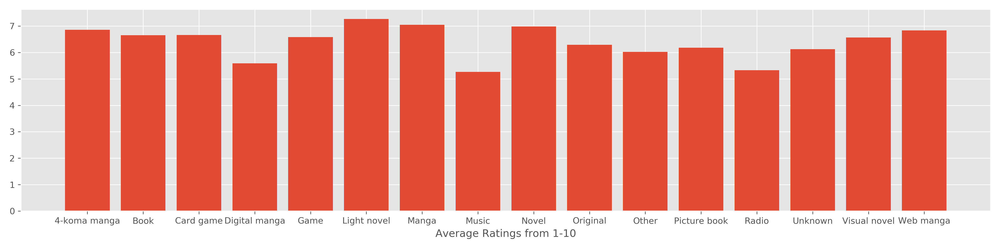
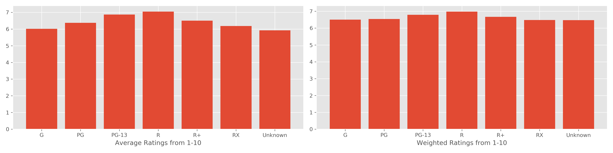
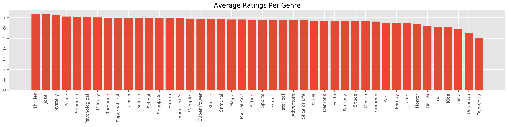

# Find Your Next Anime

## Motivations & Goals
Since shelter-in-place was enacted, more people have been staying home looking for more ways to pass the time. Like many, I found myself wanting to escape to a world of fantasy, and found that anime was the best way to do this.
 However, when I finished one anime, I was surpised how difficult it was to find a similar anime to the one I enjoyed. It required searching on Google and going through various forums to find suggestions that seemed aligned to my tastes.
 I have two goals for this project:
 1) A content based recommender that will recommend shows/movies similar to my last favorite anime
 2) An item-item collaborative filter recommender system that will recommend anime based on the ratings and reviews of users similar to me.

## The Data:
 **-anime_df**: 12,294 animes with name, genre, type, number of episodes, avg_rating, and members
 **-rating_df**: 7M reviews of 11,200 animes from 73,515 users
 **-anime_meta**: 14,478 animes with additional features: English title, dates aired, duration of anime, rating (PG,G,R, etc.), producer, studio, opening & ending theme songs
 **-users_meta**: 302,673 unique users with number of episodes watched, along with gender, birthdate, location, membership_date
 **-Optional: concepts_titlesonly**: 391706 anime titles & concepts, but no anime_id, so will be difficult to group with current dataset

## Data Cleaning
 Ratings: Removed all ratings with '-1' which indicates no rating.
 NOTE: Ratings matrix does not have ALL of the ratings provided by the users that make up the average rating column in the anime_df, will need to consider this for the collaborative filter based recommender. 
 **Combining dataframes to get one large dataframe with all metadata for each anime**
 The function for below cleaning is stored in src/data_funcs.py, full_anime_df() function: 
 The anime data and rating data were combined in order to calculated weighted rating based on number of members that rated the anime.
 The anime meta data was joined with the anime dataset through the anime_id.
 The rating types were streamlined to: G, PG, PG-13, R, R+,Rx, and "Unknown" for any blank values.
 The blanks for genre, studio, and producer were also filled with "Unknown".
 Dropped any duplicate columns contained in both the anime_meta dataset, and the anime dataset. Dropped any irrelevant columns with many nulls, or data that is not useful.
 **Exploding the Genre, Producer, & Studio columns to see trends**
 The function for performing this operation is the explode_text() function in src/data.py.

## EDA
**Comparing the average rating to the weighted ratings**
-avg_rating from the anime dataset: 6.473902
-weighted_rating average from the anime dataset: 6.654531

-Weighted ratings are more closely centered around the mean, right more positive right skew, meanwhile average ratings are more normally distributed.
-Average ratings from the user rating dataset: 7.8
-Could be due to rating data missing some ratings of animes listed in the anime dataset

**Ratings across different features**
-No major differences between anime type or source

 -On average (not weighted), the PG-13 & R animes are doing slightly better than other rating types.

-Comparing different genres, there are some genres that do much better/worse than majority.

-Comparing the top 20 studios and producers, there are clear studios that are more highly rated by users.
   

User metadata from users_meta:
-Gender
-Location
-Birthdate > convert to age
-Member since data > Age of membership
-Stats_episode > How active is the user?
-Stats mean score > How generous/strict is the user?
-username: Could we pull anything useful from the usernames? NLP?

## Content Based Recommender System:
**Anime_id Keyword**
 -To help users search for the anime_id desired, a helper function called find_id() in src/model_funcs.py was created, which will return all titles that have the keyword.
 **Baseline Content Based Recommender:**
 -Features: Type (Movie, TV, etc.), Source (Manga, Music, Book, etc.), Rating Type (PG, R, etc.), and Weighted Rated.
 -Similarity Metrics: Tested Cosine Similarity & Pairwise Distance. Spot-checking a few popular animes in each genre, Pairwise Distance performs the best with genre related recommendations, but is recommending unpopular anime, cosine similarity is recommending the popular anime, but not good at narrowing down to the right genre. 
 Results: (With cosine similarity), looking up recommendations for "Inuyasha"
   
 **Content Based Recommender Iteration 2:**
 -Added dummified genre to the content based model
 -Based on the EDA, some producers/studios have higher ratings overall than others, only the top 20 studios and producers will be captured in the next content based model.
 -Overall, the genre significantly helped with the recommendations. The recommender is now recommending more highly rated anime that is closer to the genre specified, though not perfect
   
 **Content Based Recommender Iteration 3**
 -Adding Studio/Producers had almost no impact on the similarity matrix of the iteration with only genre added.
 -Explored clusters of producers & studios, but as there are many duplicates in multiple clusters, did not think this would be worth exploring.

Clusters of Producers:
 0, Bandai Visual, Pink Pineapple, Lantis, Sanrio, Fuji TV
 1, Unknown, Bandai Visual, Aniplex, NHK, TV Tokyo
 2, TV Tokyo, Tokyo Movie Shinsha, Sanrio, Sotsu, Milky Animation Label
 3, NHK, Sanrio, Tokyo Movie Shinsha, Fuji TV, Milky Animation Label
 4, Aniplex, Tokyo Movie Shinsha, Sanrio, Fuji TV, Milky Animation Label

Clusters of Studios:
 0, Sunrise, Madhouse, Production I.G, Studio Pierrot, TMS Entertainment
 1, Unknown, Sunrise, Madhouse, J.C.Staff, Studio Pierrot
 2, Studio Deen, Toei Animation, Sunrise, OLM, Xebec
 3, J.C.Staff, Toei Animation, Sunrise, OLM, Xebec
 4, Toei Animation, Unknown, Nippon Animation, OLM, Tatsunoko Production

**Flash App**
-Use the anime_full['image_url'] column which has links to all anime photos, checked out url and it did not, but try later

## Next Steps & Conclusion
 -N-grams for the genre, pairs may be useful?

### Data Sources:
Anime & user metadata from : https://www.kaggle.com/azathoth42/myanimelist
Anime and rating data from: https://www.kaggle.com/CooperUnion/anime-recommendations-database

